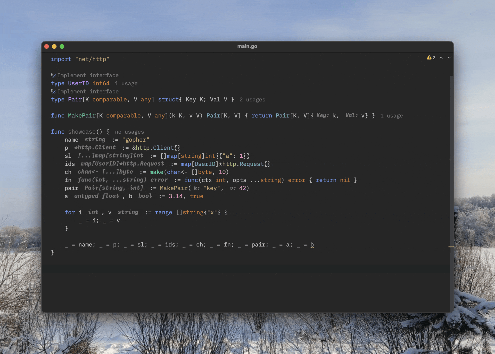

# GoTools

A GoLand / IntelliJ plugin that adds missing quality-of-life features for Go development.

## Inlay Type Hints

Type hints for short variable declarations (`:=`), range clauses, const/var blocks — anywhere Go infers the type and doesn't show it.

Hints are clickable (navigate to type definition) and fully customizable:

| Option                | Styles                                                                                         |
|:----------------------|:-----------------------------------------------------------------------------------------------|
| Pointer prefix        | `*int` &nbsp; `^int` &nbsp; `&int` &nbsp; `ptrOf int`                                          |
| Channel arrows        | `<-chan / chan<-` &nbsp; `← chan / → chan / ⇄ chan` &nbsp; `chan recv / chan send / chan bdir` |
| Channel type brackets | `chan int` &nbsp; `chan(int)` &nbsp; `chan[int]` &nbsp; `chan⟨int⟩`                            |
| Generic brackets      | `[T]` &nbsp; `⟨T⟩` &nbsp; `<T>`                                                                |
| Variadic / ellipsis   | `...` &nbsp; `…` &nbsp; `⋯` &nbsp; `~`                                                         |
| Separator             | `, ` &nbsp; ` \| ` &nbsp; `; `                                                                 |
| Function literal      | `func(...)` &nbsp; `ƒ(...)` &nbsp; `(...)`                                                     |

Other settings: max hint length (long types get truncated), toggle type parameter rendering and their constraints, leading space.

## Builder Pattern Generator

<kbd>Alt+Enter</kbd> or <kbd>Cmd+.</kbd> on any struct → **Generate struct builder**.

Generates a fluent builder: exported interface with `With*` methods, unexported implementation, constructor, and a `B()` terminal method. Supports generics.

Pick which fields to include from the standard GoLand member chooser dialog. Exported fields are unchecked by default (they're directly settable anyway).

## Installation

**From Marketplace** (when published): Settings → Plugins → search "GoTools"

**From disk**: grab the `.zip` from [Releases](https://github.com/pyrorhythm/gotools/releases), then Settings → Plugins → ⚙ → Install from Disk

## Requirements

GoLand 2025.3+ or IntelliJ IDEA 2025.3+ with Go plugin
